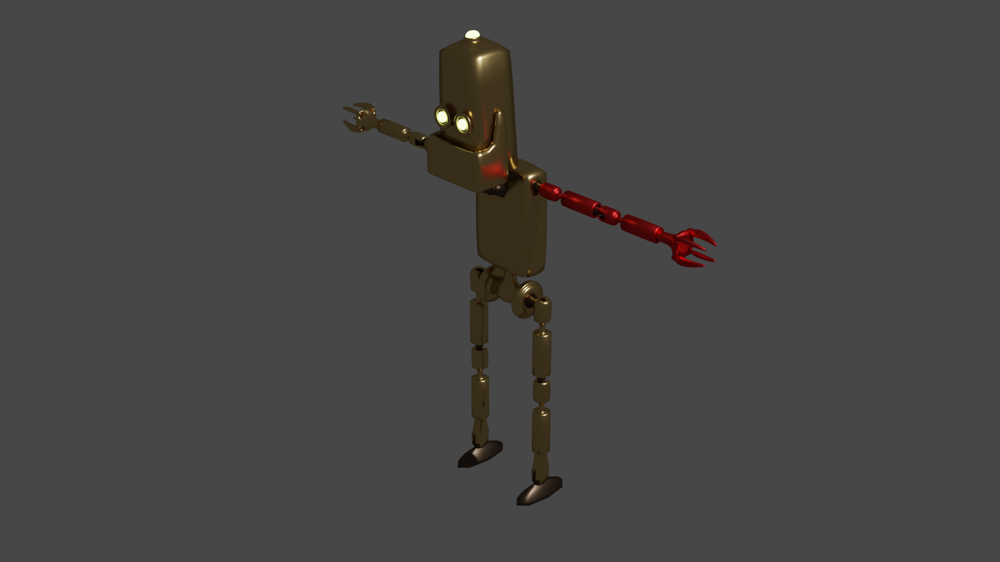

<picture>
  
</picture>

<picture>
  
</picture>

<picture>
  
</picture>

**Degree in Computer Engineering (UIB)** 

**Master's degree in Teacher Training (UIB)**

**Video game and virtual reality development with Unity 3D [600h] (Tokio School)**

**Video game design [300h] (Tokio School)**

<picture>
  
</picture>

  **Developer at habitissimo [3 years]**

  &nbsp;
  &nbsp;
  &nbsp;
  &nbsp;
  &nbsp;
  &nbsp;

  &nbsp;
  &nbsp;
  &nbsp;
  &nbsp;
  &nbsp;
  &nbsp;

  **Developer at Limit Tecnologies [1/2 year]**

  &nbsp;
  &nbsp;
  &nbsp;
  &nbsp;

  **Developer at TravelgateX [1/2 year]**

  &nbsp;
  &nbsp;
  &nbsp;

  **Vocational Education Teacher [1 academic year]**

  &nbsp;
  &nbsp;
  &nbsp;

<picture>
  
</picture>

**Outdoor Activities Instructor [4 years]**

**Outdoor Activities Supervisor [1 year]**

<picture>
  
</picture>

_Not all skills have been learned through work experience_

&nbsp;
&nbsp;
&nbsp;
&nbsp;

**Always Learning**

_Eventhough practice makes perfect, I believe it helps to have a good foundation to build from_  
_that's why I love online courses and reading books_

_I've done quite some courses from MiriadaX, Edx, Udemy, Coursera and other platforms related to all kinds of topics_

Among the books I've read, I would really recommend:

<table>
	<tr>
		<td>The Clean Coder (Developers)</td>
		<td>Project Phoenix (Developers + Devops)</td>
	</tr>
	<tr>
		<td>Clean Architecture (Developers)</td>
		<td>Personal Kanban (Project Management + Personal use)</td>
	</tr>
	<tr>
		<td>Head First: Design Patterns (Developers)</td>
		<td>Level Up! The guide to great game design (Game Designers)</td>
	</tr>
</table>

<picture>
  
</picture>

<table>
  <tr></tr>
  <tr>
    <td>Board Games</td>
    <td>Sports</td>
    <td>Reading</td>
  </tr>
  <tr>
    <td>Board Game design</td>
    <td>Climbing</td>
    <td>Writing</td>
  </tr>
  <tr>
    <td>Video Games</td>
    <td>Hiking</td>
    <td>Drawing</td>
  </tr>
  <tr>
    <td>Video Game Design & Development</td>
    <td>3D Modelling</td>
    <td>Painting</td>
  </tr>
</table>

<picture>
  
</picture>

<picture>
  
</picture>

_The code for most of those games can be found in my GitHub repos._  
_Some of them aren't public repos because of the licensing of some assets used._  
_I'm also a member of [G4M30V3R-T34M](https://github.com/G4M30V3R-T34M), a group of friends who participate in Game Jams_

<picture>
  
</picture>

_Among other games I'm currently working on, PEP and Volley Legends are the most polished ones_ 

<picture>
  
</picture>

<picture>
  
</picture>

_All my short stories are written in Spanish_

**La última operación**  
Published on [Tentacle Pulp](https://www.tentaclepulp.com/index1.php?i=0)

Other short stories published on [Wattpad](https://www.wattpad.com/user/Neengash)

